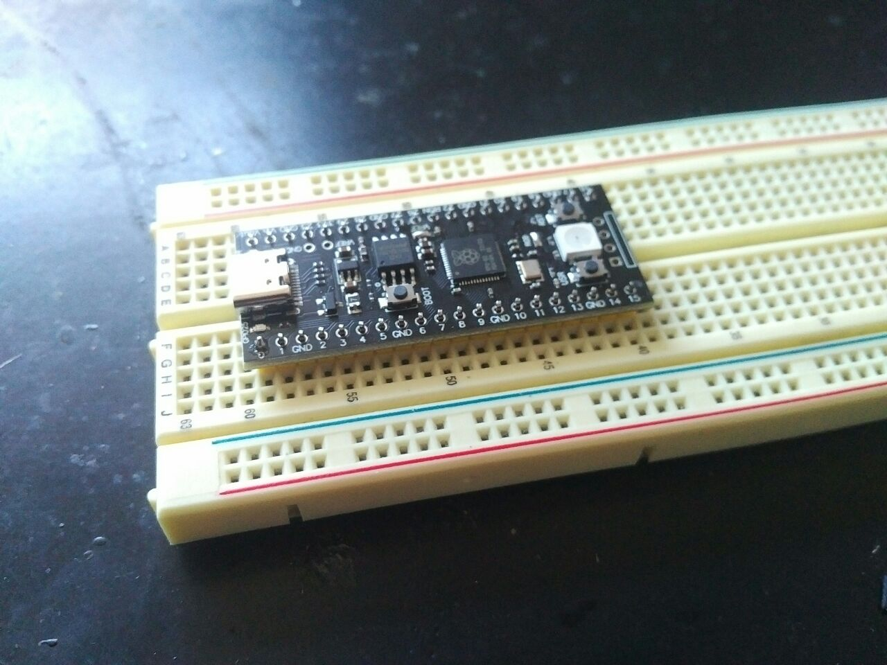

# Building instructions
## 1. Before you start
- If you don't have that much soldering experience we recomment you read this [excellent guide](https://learn.adafruit.com/adafruit-guide-excellent-soldering).
- You might be able to skip some steps depending on your Kit / Parts.
- Your PCBs might look slightly different than those in the pictures.
- To get a clean build a lot of dry fitting should be used. That means you loosely stack all the parts needed and once everything is in place you start to solder. Sometimes you can use a small tape or rubber band to keep everything together. Start by soldering 2 opposing pins per component to keep everything in place. Then solder all the other pins.
## 2. Prepare your headers
- You might need to cut your headers to the right length.
- You need:
  - 2 male and 2 female headers for the RP2040 board (20 pins long)
  - 3 male and 3 female headers 8 pins long
  - 2 male headers 5 pins long OR 1 male 10-pin IDC connector
- To separate male headers: 
  - Grab the pins before and after the point of separation and twist them.
- To separate female headers: 
  - Use the diagonal cutters and cut in the middle of the next socket (you will have to sacrifice one socket).
  - Make sure the flat side is facing the part of the header strip you want to use.
  - Cleanup the edges if needed.
## 3. Solder male headers to the RP2040 board
- Use a breadboard to make sure the headers are straight.
- The 4 pin header is not used and should not be soldered.
- Be carefull to not bend any pins when you remove the assembly from the breadboard.

## 4. Separate the front and the back PCB
- Use the diagonal cutters with the flat side facing the PCB and the angled facing the bridge.
- Cleanup the edges if needed.

## 5. Solder headers between the PCBs
- The PCBs are connected by 3 headers that are 8 pins long each.
- Dry fit everything first and once everything is in place start to solder the whole assembly!
- Both PCBs have a smiley printed on them. These smileys should face each other in the final assembly!
- The male headers should be soldered to the main PCB (the one with the Pyro logo). The female headers should be soldered to the front PCB (the one with the jack sockets).
## 6. Check the ground (Gnd) connection
- Use a multimeter to check that both PCBs have a good ground (Gnd) connection. Measure the resistance between the 'Gnd' pin of the 'I2C EX' header on the main PCB) and the negative (-) pin of 'LED1' on the front PCB. The resistance should be 1 Ohm or less.
- If it is more:
  - Check that your multimeter shows 0 Ohm if you connect both probes directly.
  - Check all solder joints of the headers.
## 7. Solder female headers for the RP2040 board
- Separate both PCBs again and dry fit the RP2040 board with the female headers onto the main PCB.
- The 3 pin header is not used and should not be soldered.
- Once everything is in place start to solder.
## 8. Solder the eurorack power connector
- Solder the male 10-pin IDC connector OR 2 5-pin male headers for the eurorack power connector.
- The eurorack power connector is located left of the Pyro logo on the main PCB.
- The 'I2C EX' header should only be soldered if you need it to connect extension modules.
## 9. Solder the jack sockets
- Dry fit the jack sockets together with the front panel to the front PCB.
- Once everything is in place start to solder.
## 10. Solder the encoders
- Dry fit the encoders together with the front panel to the front PCB.
- Once everything is in place start to solder.
## 11. Select the display pinout
- There are 2 solder jumpers (J1 and J2) on the back of the front PCB. These are used to select the display layout. You have to connect the center pad with the right or with the left pad.
- Compare your displays pin layout to the one printed on the PCB.
- If they match:
  - For both jumpers: Connect the center pad to the pad WITH the ^ marking
- If Gnd and Vcc are swapped:
  - For both jumpers: Connect the center pad to the pad WITHOUT the ^ marking
- Use the multimeter to check that there is no connection between Gnd and Vcc of the display header.
- If you have a connection between these points, one of the jumpers is causing a short circuit.
## 12. Dry fit and solder the display
- This step is difficult since the display header will barely be long enouth. But it works. Just make sure there is a good connection.
- Dry fit the display together with the front panel to the front PCB.
- Once everything is in place start to solder.
## 12. Dry fit and solder the LEDs
- Attantion: You might have 6 LEDs of one color (Output 1 to 6) and 2 LEDs of a different color (Output A and B)!
- Make sure to get the polarity right (longer leg of the LED is +)!
- Dry fit the LEDs together with the front panel to the front PCB.
- You can now leave the front panel attached after soldering.
- Once everything is in place start to solder.
